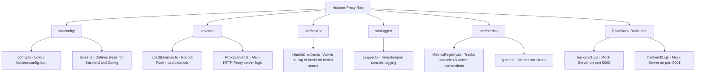

# Horizon-proxy: Project Analysis

Horizon-proxy is a lightweight, custom-built reverse proxy and load balancer written in TypeScript and powered by Node.js. It acts as an intermediary server that distributes client HTTP requests across multiple configured backend servers, handles health checks, and gathers detailed performance metrics.

---

## 1. Project Purpose & Core Features

At its core, **Horizon-proxy** serves as a reverse proxy and load balancer with the following features:
*   **Reverse Proxying**: Forwards incoming HTTP requests to downstream backend servers and returns their responses to the client.
*   **Load Balancing**: Implements a Round-Robin scheduling algorithm to distribute load evenly across backends.
*   **Health Checking**: Periodically probes backend servers on a `/health` endpoint. If a backend goes down, the proxy stops routing requests to it until it recovers.
*   **Metrics Gathering**: Exposes real-time request metrics, active connections, and latency snapshots via a special `/metrics` endpoint.
*   **TypeScript-First**: Developed in TypeScript with ESM module resolution and type checking.

---

## 2. Directory Structure and Components

Here is a visual map of the project files and directories:



### Component Details

#### ⚙️ Configuration (`src/config/`)
*   [config.ts](./src/config/config.ts): Reads and parses `horizon.config.json` in the root workspace.
*   [types.ts](./src/config/types.ts): Declares TypeScript interfaces for `Backend` (representing a target server with properties: `id`, `host`, `port`, `healthy`) and `HorizonConfig` (defining the proxy server `port` and the list of `backends`).
*   [horizon.config.json](./horizon.config.json): Specifies the proxy's running port (default `3000`) and the available backend targets (ports `5000` and `5001`).

#### 🔀 Core Proxy and Load Balancing (`src/core/`)
*   [LoadBalancer.ts](./src/core/LoadBalancer.ts): Maintains a counter to select the next healthy backend in a Round-Robin pattern. Throws an error if no healthy backends are available.
*   [ProxyServer.ts](./src/core/ProxyServer.ts): Coordinates the main HTTP server using Node's `http` module.
    *   Intercepts requests to `/metrics` to return the real-time system performance snapshot.
    *   Finds a healthy backend through the load balancer, creates a proxy request (`http.request`), logs the request translation, pipes request/response bodies, and tracks durations for latency statistics.
    *   Returns appropriate error status codes: `503 Service Unavailable` if no backends are healthy, and `502 Bad Gateway` if proxy forwarding fails.

#### 🏥 Health Checks (`src/health/`)
*   [HealthChecker.ts](./src/health/HealthChecker.ts): Runs an active interval loop (default: `5000ms` interval, `2000ms` timeout) to request the `/health` endpoint of each backend. Automatically transitions the backend's in-memory `healthy` property to `false` on request error/timeout or non-200 responses, and logs transitions to console.

#### 📊 Metrics Monitoring (`src/metrics/`)
*   [MetricsRegistry.ts](./src/metrics/MetricsRegistry.ts): Tracks global metrics (uptime, active connections, total requests) as well as per-backend metrics (total requests, current active connections, average latency).
*   [types.ts](./src/metrics/types.ts): Structure definitions representing the internal state values.

#### 🪵 Logging (`src/logger/`)
*   [Logger.ts](./src/logger/Logger.ts): Provides helper methods `Logger.info` and `Logger.error` to output ISO-timestamped strings to stdout.

#### 🧪 Mock Backend Servers
*   [backend1.cjs](./backend1.cjs): Running on port `5000`. Handles `/health` with a `200 OK` ("OK") and standard requests with `"Backend 5000"`.
*   [backend2.cjs](./backend2.cjs): Running on port `5001`. Handles `/health` with a `200 OK` ("OK") and standard requests with `"Backend 5001"`.

---

## 3. Project Entry Point
The project boots from [src/index.ts](./src/index.ts), which loads the configurations, initializes the `ProxyServer` instance, and fires the proxy start handler.

```typescript
import { loadConfig } from './config/config.js';
import { ProxyServer } from './core/ProxyServer.js';

const config = loadConfig();
const proxy = new ProxyServer(config);

proxy.start();
```

---

## 4. Run Scripts & Dependency Context
The project uses the following node commands defined in [package.json](./package.json):
*   `npm run start`: Starts the proxy server via `node --import tsx/esm src/index.ts`.
*   `npm run format`: Standardizes source formatting with Prettier.
*   `npm run format:check`: Validates file formatting with Prettier.

Dev dependencies include:
*   `tsx`: Execute TypeScript files directly in modern ESM contexts.
*   `typescript`: Standard TS compilation and types check configuration.
*   `prettier`: Enforce standard formatting styles.
